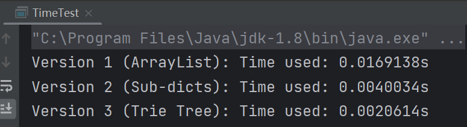
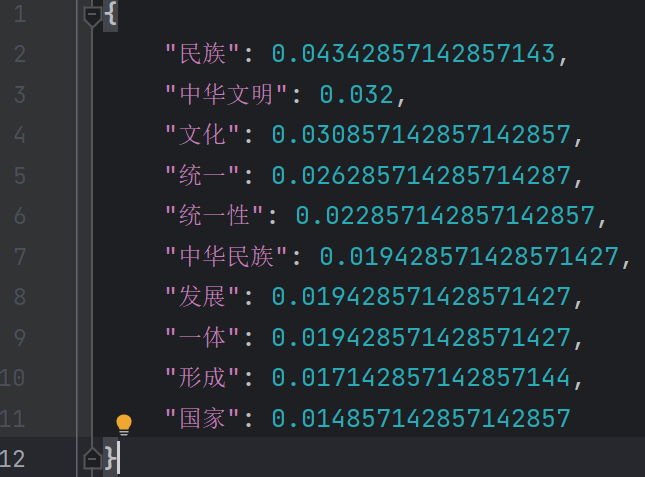

# 实验一 基于正向最大匹配算法的分词
## 10235501419 李佳亮
### 报告预览

​	本次实验中采用Java语言实现了3个版本的最大正向匹配算法。它们的主要区别在于函数接收的字典的储存方式不同，因此查找的速度也不同。

​	版本1是最朴素的，字典中的词全部存进一个`ArrayList`对象里。为了优化查找速度，对字典进行预处理，得到了两个优化后的版本。版本2中字典被构建为一个`HashMap<Integer, List<String>>`对象，按字典中的单词长度映射到相应字典；版本3中字典采用`前缀树(Trie)`进行存储。

### 实验过程

#### 1. 对最大正向匹配算法的理解

​	最大正向匹配算法（FMM）是一个贪心算法，它的输入为：待分词的字符串`str`、词典`dict` 和 最大匹配长度`maxLen`（一般选为词典中单词的最大长度），输出为：分词后各个单词构成的有序列表。

​	顾名思义，“最大正向匹配算法”的”匹配“原则就是“最大”和“正向”。“最大”指的是优先从字符串中选取一个最大（不大于`maxLen`）的子串与词典中的单词进行“匹配”，而“正向”指的是算法从左到右来选取子串。如果当前长度匹配失败的话，就减少末尾的一个字符继续尝试匹配，直至匹配成功或变为单个字符。接着，对剩余未分词的字符串再接着进行最大正向匹配。

​	这个算法是一个比较初级的分词算法。

#### 2. Java 实现最大正向匹配分词算法

##### （1）朴素版本FMM的实现

​	函数内维护一个`String remainder`存储尚未被分词的子串，在函数开头被初始化为整个字符串`str`；维护一个`List<String> res`存储分词后的结果。当`remainder`不为空时，取其前`maxLen`个字符作为待匹配词`cur`，遍历词典看看有没有匹配上的词（可以用包装好的`contains()`方法）。若找到匹配词，将`cur`加入`res`中，并且截取待处理字符串`remainder`，将其去掉匹配词`cur`；若没有找到，`cur`就缩减一个字，继续匹配。这里要注意一些临界条件：①当`remainder`的长度不足`maxLen`个时，直接取整个`remainder`作为待匹配词`cur`；②当`cur`的长度缩减到1时，直接把其加入到结果列表中。

##### （2）优化思路与具体实现 

​	这里主要考虑优化FMM算法所耗费的时间。FMM算法主要耗费的时间都在查找上。

​	在（1）中的实现中有许多无用的查找。在匹配长为`x`的子串的过程中，对词典中长度为非`x`的查找都是无用的。因此，我们可以考虑**把词典按词语的长度划分为多个子词典**。在具体实现上与（1）类似，只是我们用一个`HashMap<Integer, List<String>>`对象来保存这个词典，按词典中的单词长度映射到相应词典。这样，我们在匹配长度为`x`的子串时，只需要查找长度为`x`的子词典即可。

​	时间复杂度分析：假设共$n$个单词，词典中各个长度的单词是均匀的，那么每个子词典平均大小是$\frac{n}{maxLen}$，那么最坏情况下，每次匹配的时间复杂度为$O(maxLen * \frac{n}{maxLen}) = O(n)$。

​	此外，我们还可以考虑**用`前缀树`这一数据结构来存储词典**。前缀树本质是一棵多叉树，其根结点是一个虚拟节点，不存储任何字符；此外的每个结点代表一个字符。前缀树的核心思想就是利用字符串的公共前缀来减少无用的字符串比较。

​	用前缀树查找的方式和前面两种方式有些不同。它并不是从长度最大的子串开始匹配，而是尽可能地“向深处”去搜索，一旦发现有一个可以匹配到的（可能不是最长的）词语就记录下来，不需要下次再次查询一遍。并且，一旦发现子节点中没有当前子串的下一个字符，就及时止损、跳出循环，返回最后一次记录到的匹配到的词语。

​	时间复杂度分析：`hashMap.containsKey()`的时间复杂度是$O(1)$，每次查询最多需调用`maxLen`次，故每次匹配的时间复杂度最差为$O(maxLen)$。

​	在本次实验的数据上对这三种方法进行计时测试，发现在本次的实验中，分词速度 前缀树 优于 划分子词典 优于 朴素版本。

### 实验结果
