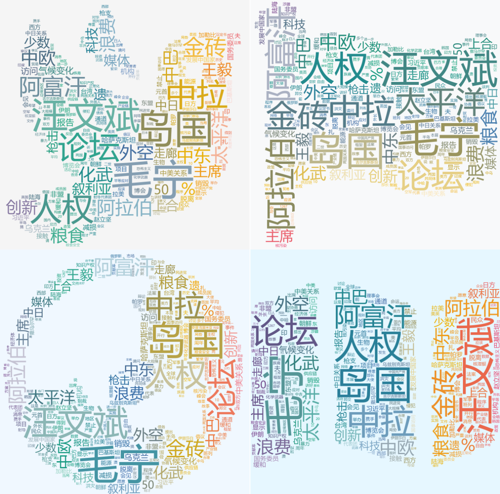
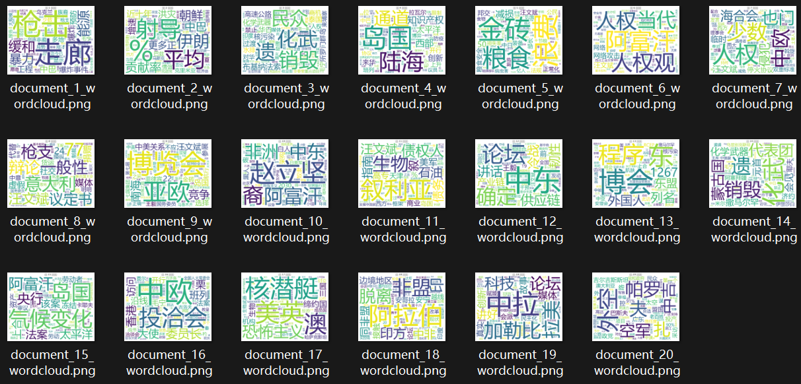

#  **实验二 词云统计**

## 10235501419 李佳亮

本次实验用jieba分词库对20篇记者会文章进行分词，自行实现TF-IDF算法，并用TF-IDF值作为词频指标，用stylecloud库绘制了这20个文档的总词云与各自的词云。

### 实验过程

####  一、对文档进行分词

​	我们的分词需要对文档去除停用词。读取停用词词典`cn_stopwords.txt`，将停用词存入列表`stopwords`中，然后循环读取`1.txt`~`20.txt`用jieba库进行分词，将分词结果去除停用词后存入字典`dict`中。该字典的key为文档编号1~20，value为文档分词后得到的列表。

​	对于jieba库的使用：

```python
import jieba
# line为待分词的字符串 返回结果为列表
jieba.lcut(line.strip())
```

#### 二、TF-IDF计算

##### （1）TF-IDF算法实现

​	我们创建一个类TF-IDF，其输入为`dict`字典，字典的key为文档编号，value为字典的分词列表；可以输出在该文档集合下各个词在各个文档中的TF-IDF值。

​	该类包含四个成员变量：

- `dict` - 存储输入字典。
- `dict_tf` - 存储TF值的字典，key为文档编号，value为词频字典。
  - 词频字典的key为词，value为该词的TF值。
- `dict_idf` - 存储IDF值的字典，key为词，value为逆文档频率。
- `dict_tf_idf` - 存储TD-IDF值的字典，key为文档编号，value为TF-IDF字典。
  - TF-IDF字典的key为词，value为该词的TF-IDF值。

​	根据计算公式，我们实现三个方法`calc_tf`，`calc_idf`和`calc_tf_idf`，分别用于计算词频TF、逆文档频率IDF和TF-IDF。下面，$t$是具体的某个词，$\mathcal{D}$是文档集合，$\bold d\in \mathcal D$是其中的某个文档，则

- $TF(t,\bold d)=\frac{t在 \bold d中出现的次数}{ \bold d中总词数}$
- $IDF(t, \mathcal D)=\log\frac{\mathcal D中文档总数}{\mathcal D中包含该词的文档数+1}$
- $TF-IDF(t,\bold d, \mathcal D)=TF(t,\bold d)\times IDF(t, \mathcal D)$

```python
import math
# TF-IDF算法
# 输入：一个字典，key为文档编号，value为分词列表
class TF_IDF:
    def __init__(self, dict):
        self.dict = dict
        self.dict_tf = {}   # 词频，key为文档编号，value为词频字典
        self.dict_idf = {}  # 逆文档频率，key为词，value为逆文档频率
        self.dict_tf_idf = {}   # TF-IDF，key为文档编号，value为TF-IDF字典

    # 计算TF=t在d中出现的次数/|d|
    def calc_tf(self):
        for i in self.dict.keys():
            self.dict_tf[i] = {}
            for word in self.dict[i]:
                if word in self.dict_tf[i]:
                    self.dict_tf[i][word] += 1
                else:
                    self.dict_tf[i][word] = 1
            for word in self.dict_tf[i]:
                self.dict_tf[i][word] /= len(self.dict[i])

    # 计算idf=log(文档总数/(包含该词的文档数+1))
    def calc_idf(self):
        # 记录每个词在几个文档里出现
        for i in self.dict.keys():
            for word in set(self.dict[i]):
                if word in self.dict_idf:
                    self.dict_idf[word] += 1
                else:
                    self.dict_idf[word] = 1
        for word in self.dict_idf:
            self.dict_idf[word] = math.log10(len(self.dict) / (self.dict_idf[word] + 1))

    def calc_tf_idf(self):
        for i in self.dict.keys():
            self.dict_tf_idf[i] = {}
            for word in self.dict_tf[i]:
                self.dict_tf_idf[i][word] = self.dict_tf[i][word] * self.dict_idf[word]
```

##### （2）计算TF-IDF值

​	我们直接用刚刚得到的`dict`来实例化一个TF-IDF对象，并调用其成员方法来得到TF-IDF字典。

#### 三、绘制词云图

​	下面我们用stylecloud库为这个文档集合画一个词云。

​	由于相同的词在不同的文档中，TF-IDF的值是不同的，因此，对某个词$t$，我们求出它在所有这20个文档中的TF-IDF总值来作为指标，来绘制这20个文档集合的词云图。

​	此外，对于每个文档，我们也能绘制每个文档的词云图。

​	为了使词云图更加符合该文档集合的主题，即外交部发言人的例行记者会的会议纪要，我们可以从stylecloud库中选择几个符合主题的图标来绘制词云，如象征和平的和平鸽，象征着国家的国旗，象征世界大同的地球图标等。

​	用stylecloud库绘制词云时，要先把总的TF-IDF字典转为两列分别为词语和权重（即TF-IDF总值）的csv格式，因为stylecloud.gen_stylecloud接收csv文件作为输入来绘制词云。

### 实验结果

​	这20个文档的总的词云图（展示了四种不同的样式）：



​	20个文档分别各自的词云图：



### 实验创新点

1. TF-IDF指标类的实现：手动实现了TF-IDF类，用于计算文档集合的TF-IDF指标。
2. 多样词云图的绘制：使词云图更加符合该文档集合的主题，即外交部发言人的例行记者会的会议纪要，选择了几个符合主题的样式来绘制词云。

3. 分别绘制了20个文档各自的词云图和20个文档的总词云图。

### 附录（GitHub仓库链接）

- [main.ipynb](https://github.com/zzsyppt/natural-language-processing/blob/main/lab2/main.ipynb) - 本次任务代码实现

- [output/](https://github.com/zzsyppt/natural-language-processing/tree/main/lab2/output) - 绘制的词云图