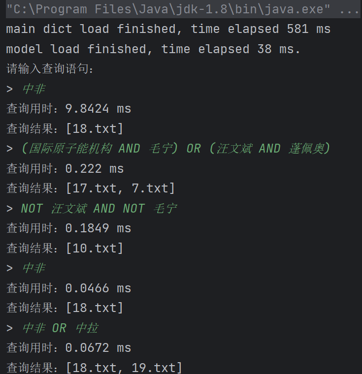

# Lab3 倒排索引

## 10235501419  李佳亮

​	本次实验采用Java语言，读取20个中文文本文档，用jieba包分词后构建了倒排索引，用哈希技术优化检索速度，并实现了支持复杂布尔表达式的关键词检索。

### 实验过程

#### 1. 分词与倒排索引的构建

​	本部分封装在类`InvertedIndexBuilder`中。该类可以遍历指定路径下的所有文档并分别按要求进行分词（去除标点、数字、单字），并对其中的词进行倒排索引。由于JAVA没有能直接导入的分词包，下载适用于JAVA的jieba包到本地后再导入。

​	为了优化检索的时间，本次实验采用的数据结构始终离不开哈希技术。倒排索引采用了`HashMap`的数据结构，其Key为词（`String`对象），Value为存储着包含该词的文档唯一标识符的`HashSet`。用这种数据结构有良好的时间复杂度。

​	具体实现部分，读取文件名，存进一个`HashSet`中。遍历每个文件，读取文件内容并用jieba对象分词；分词过程中，过滤掉标点、数字、单字，并把改文件名加入到存储着该词的索引的`HashSet`中。

#### 2. 处理复杂布尔表达式（创新点）

​	本程序不仅支持包含某一个特定词的文档的检索，而且可以支持用户输入复杂的布尔表达式，如`A AND B`，`A AND (B OR C)`诸如此类（运算符前后应有空格分割）。下面我们称`A B C`等为检索词，`AND OR NOT`为运算符。我们要对用户输入的表达式进行解析。

​	处理这种表达式需要三步：①将用户输入的表达式字符串转化为由检索词、运算符（AND/OR/NOT）和括号构成的有序列表，便于后续处理；②将中缀表达式转换为后缀表达式；③使用栈计算后缀表达式。该部分的工作封装在多个类中。

##### （1）处理为列表

​	方法`tokenize()`接收一条布尔表达式，返回列表。方法遍历布尔表达式的每一个字符，维护一个`StringBuilder`对象来构建字符串作为列表中的元素。

- 遇到普通字符时，将该字符加到`StringBuilder`中；
- 遇到括号时，先把`StringBuilder`中存储的字符串作为一个token添加到结果列表中，并清空 `StringBuilder`（这是为了处理用户输入的表达式的括号前没有空格的情况），再把括号作为单个token加入到结果列表中；

- 遇到空格时，将 `StringBuilder` 中存储的字符串作为一个token添加到结果列表中，并清空 `StringBuilder`。这个token可能是运算符AND/OR/NOT或检索词。

##### （2）转换中缀表达式为后缀表达式

​	方法`toPostfix()`接受一条`List<String>`类型的中缀表达式，返回与之等价的`List<String>`类型的后缀表达式。

​	我们维护一个栈来存储运算符和括号。Java中栈用`Deque`实现（比`Stack`更常用）。遍历中缀表达式的元素`token`：

- 遇到左括号`(`：直接入栈，表示新的子表达式开始；
- 遇到右括号`)`：栈顶元素一直出栈并将其加入到结果列表中，直到遇到与之匹配的左括号（即第一个遇到的左括号。左括号不加入结果列表）；
- 遇到运算符：比较当前运算符`token`与栈顶元素运算符的优先级（栈顶元素也有可能是左括号，在具体实现过程中，由于左括号不是运算符，我们采用默认值`0`作为其优先级，因为左括号只会在遇到右括号时才弹出栈），如果`token`的优先级低于或等于栈顶运算符，那么弹出栈顶元素并加入结果列表，重复，直到遇到的栈顶运算符的优先级小于`token`，再将`token`入栈；
- 遇到检索词：直接加入结果列表。

​	当遍历结束后，我们要把栈中剩下的所有元素弹出并加入结果列表。

​	有关运算符优先级：运算符的优先级顺序为NOT>AND>OR。为了代码简洁，我们用`HashMap`对象来存储这一信息，把`NOT AND OR`分别映射到优先级`3 2 1`。

##### （3）计算后缀表达式

​	本部分封装在类`PostfixEvaluator`中。该类包含主要的方法`evaluatePostfix`和三个封装起来的辅助方法（`intersection`，`union`和`difference`）分别用于求交并差集。

​	对于这三个辅助方法我们并不需要多做一些设计。由于我们的倒排索引的索引集合是用`HashSet`实现的，我们用JAVA封装好的`retainAll`来实现交集、`addAll`来实现并集、`removeAll`来实现差集。由于它们是in-place的方法，我们要创建副本来返回结果。此外，它们有良好时间复杂度（复杂度分析见后）。

​	对于`evaluatePostfix()`方法，他接收一个`List<String>`形式的后缀表达式，返回后缀表达式计算的结果（`HashSet`类型）。后缀表达式的计算仍然需要用栈这个数据结构（用`Deque`实现），其元素为`HashSet`类型，也就是某个检索词的索引集。遍历后缀表达式中的元素`token`：

- `token`是检索词：将检索词对应的`HashSet`压入栈中；
- `token`是运算符：
  - token == AND/OR：对栈顶的两元素取交集/并集，把结果重新压入栈；
  - token == NOT：对栈顶元素进行全集为 所有文件索引 的差集操作，并把结果重新入栈。

​	最终栈内会剩下一个元素，就是表达式的计算结果，即符合查询条件的文件索引的集合。

#### 3. 主函数

​	用1中的方法构建号倒排索引后，程序采用类似Shell的方式来与用户交互，用户可以在命令行输入符合语法的查询语句，程序会用2中的方法表达式进行处理求值、打印查询耗时与结果。

### 查询时间复杂度分析

1. 对于单个词的查询，由于我们采用`HashMap`的`get`方法，若哈希冲突理想的情况下时间复杂度是$O(1)$。
2. 对于一个交集的查询A and B，实现用的是`A.retainAll(B)`方法（`A B`是词A和B对应的索引集合，类型为`HashSet`，下同），其遍历`A`的元素并检查`B`是否包含该元素。由于`HashSet`检查是否包含元素的方法`contains()`的平均复杂度为$O(1)$，那么总的时间复杂度是$O(|A|)$。
3. 对于一个并集的查询A OR B，实现用的是`A.addAll(B)`方法，其遍历`A`和`B`，因此时间复杂度为$O(|A|+|B|)$。
4. 对于一个补集的查询NOT A，采用的是`ALL.removeAll(A)`方法，其遍历`ALL`并删除`A`中存在的元素，同2，所以总的时间复杂度是$O(|ALL|)$，其中`ALL`是包含所有文件索引的集合。
5. 对于更复杂的表达式可以视作常数个上述操作。

### 实验结果

​	对于第一次查询总是会消耗更多的时间（可能是由于JAVA的JIT编译优化机制）。下面是几个查询示例。前两行为jieba分词库加载成功打印的日志。

### 附录（GitHub链接）

- [Main.java](https://github.com/zzsyppt/natural-language-processing/blob/main/lab3/Main.java) 本次实验用到的代码
- [jieba-analysis-1.0.2.jar](https://github.com/zzsyppt/natural-language-processing/blob/main/lab3/jieba-analysis-1.0.2.jar) 分词包