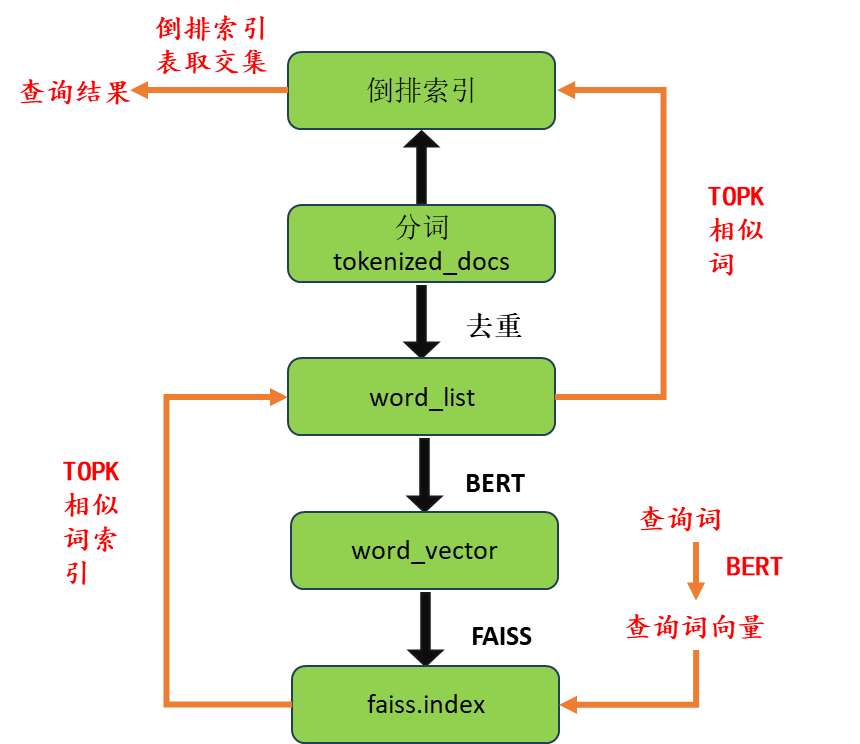
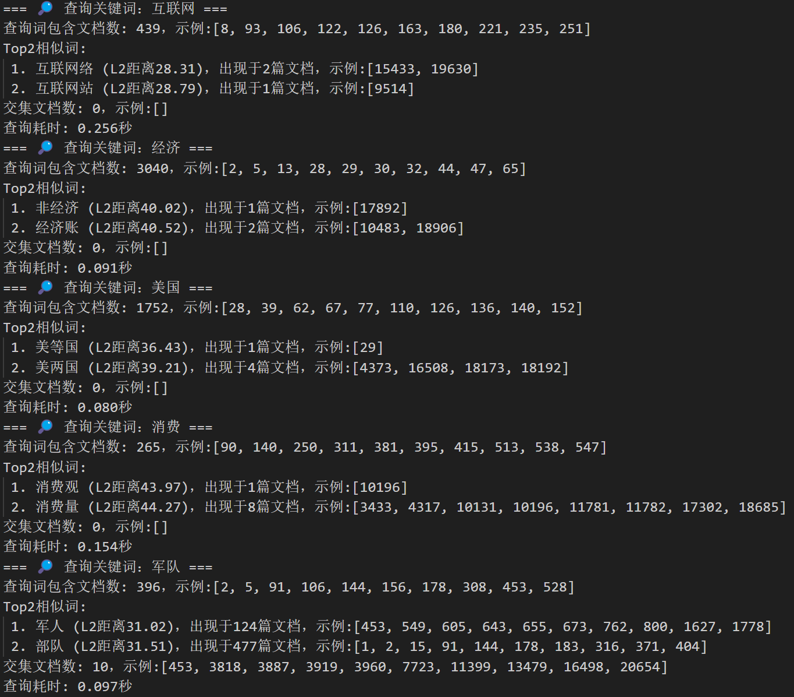
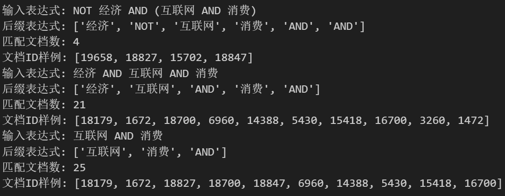

# Lab4 倒排索引与相似词查询

## 10235501419  李佳亮

​	本次实验使用python语言，实现对20738个文档的词语检索。本次实验结合了跳表优化的倒排索引，用BERT预训练模型模型对词进行向量编码，以及用FAISS构建的向量索引来实现相似向量快速检索，实现Top 2相似词的文档查询功能。 

### 实验过程

#### 1. 分词

​	本部分将用jieba分词库对20738个文档进行分词，同时去除标点、数字、单字。分词后得到一个字典对象，key为文档编号，value为文档分词后得到的列表。

​	考虑到每次运行代码时，原始文档集是静态不变的，第一次运行（冷启动时）我们把分词结果的字典缓存到`tokenized_docs.json`文件中，这样后续运行时可以直接加载该文件（热启动），大大减少了检索系统的初始化时间。

#### 2. 语义向量构建类（基于BERT编码）

​	下面，我们实现一个类`ChineseWordEncoder`，它使用Hugging Face社区上的[`hfl/chinese-roberta-wwm-ext`](https://huggingface.co/hfl/chinese-roberta-wwm-ext)预训练模型作为中文语义编码模型。该类实现一个方法`get_vector`，它接收一个中文词语并将其编码为语义向量后返回。

> [!NOTE] 
>
> BERT不是一个从词到向量的静态一一映射，而是一个计算模型。BERT对上下文敏感，它会根据输入的具体词序列来实时计算语义向量。因此，同一个词，在不同的上下文中，BERT给出的语义向量也不同。但本次实验中，我们送入BERT模型的都是孤立的词，这样的话BERT也是把它tokenize为 `[CLS] + word + [SEP]` 这一结构走一次模型做推理得到的。`[CLS]` 是BERT在设计上是用来表示整个输入序列语义的，因此最后返回的是第`0`个token的向量，也就是`[CLS]`向量。

#### 3. 相似向量快速检索（基于FAISS）

​	我们在文档中所有词汇中查找某个词的相似词汇时，需要把所有出现过的词都送入BERT编码成向量。为了防止程序后面多次运行时做重复的编码工作，我们要设计一套逻辑来保存这些词的语义向量。

- 首先，我们把所有文档中出现过的词按某一特定顺序排列，保存在`word_list.json`中。

- 接着，用BERT来逐个将`word_list.json`中的词进行编码。由于词的个数接近十万，对其进行向量化需要消耗大量的时间与空间，为了防止过程中出现中断，我们考虑在对词进行向量化的过程中将词向量保存在本地。我们用SQLite创建一个数据库文件`word_vectors.db`来存储词向量，他本质就是一个静态的键值对映射（中文词汇->该词的BERT编码向量），相较于用json保存，它更节省空间，可以按需加载与插入。【这一步不是必要的，在后续中其实用不到；如果是实际工程上数据集动态不断变动，用数据库存储会很方便更新】

- 最后我们使用FAISS构建一个快速相似向量检索引擎。给定向量组和查询向量，FAISS对象可以快速查询Top K个与之相似度最高的向量索引。
  变量`vecs`按`word_list.json`中的词的顺序存储有所有词编码的向量。

  - 用`faiss.IndexFlatL2(vecs.shape[1])`初始化一个以L2范数（欧几里得距离）为标准的扁平索引对象。
  - 调用`add(vecs)`方法向扁平索引对象添加向量组，扁平索引对象将在这个向量组中进行相似向量的检索。
  - 输入一个向量组`vectors`和数字`k`，`search(vectors, k)`方法可以返回一个二元组`(dist, indices)`，其中`indices`保存向量组中每个向量最近的k个向量的索引，`dist`保存向量组中每个向量最近的k个向量与之的距离，形状均为`(|vectors|, k)`。由于word_list中词的顺序和FAISS对象中词向量的顺序相同，`indices`返回的索引就可以通过word_list来映射回词。

  为了避免多次运行时FAISS索引的重复构建，我们调用`faiss.write_index`把它也保存在本地的`faiss.index`中。

#### 4. 倒排索引类

​	接下来构建起倒排索引类。类中维护一个字典对象`index`，他是词语到倒排表的映射。维护一个FAISS索引对象`faiss_index`，它用于查询Top K相似的向量。

​	`build`方法把3中的工作包装了起来，即接收1中分词后得到的字典、2中的语义向量构建类对象，做构建倒排索引、构建word_list、用BERT将所有词编码为向量、构建起FAISS索引对象的工作。

​	`intersect`方法接收两个列表，以跳表方式对其取交集。采用根号L策略。其逻辑为：

- 将两个升序的文档ID列表进行双指针比较；

- 当某一侧的值小于另一侧时，不是简单地移动一步，而是尝试跳跃$\sqrt{L}$步长；

- 如果跳跃位置的值仍小于目标，继续跳跃，直到超过或靠近目标；

- 若超出跳跃失败，则退回一步执行线性推进；

- 每当匹配到相等项，就加入交集结果中。

​	定义成员函数`top_k_similar`，它使用FAISS索引对象搜索与给定词向量相似度最高的`k+1`个词向量索引与距离（因为一个词向量一定与自身最相似），通过word_list将索引映射回词，并返回`k`个二元组`(word, distance)`即相似度最高的`k`个词语与其相似度距离。

​	在查询函数`search`中，我们可以在倒排索引中获得Top 2词汇的倒排索引表，以及查询词本身的倒排索引表。接着我们用跳表来做这个交集操作。注意，交集操作中我们可以首先对两个较小的列表先取交集，再把结果和第三个列表取交集。

​	构建逻辑以及查询逻辑可以用下面这张图简单表示。（真实的代码结构与之有出入，但是逻辑是图中所示）

### 实验结果

若文档过多，仅展示了前10篇文档。

### 功能扩展

​	用栈的思路实现了中缀表达式向后缀表达式的转换以及后缀表达式的计算，支持复杂布尔表达式的查询。

### 总结

​	本次实验简单实现了一个具备“语义相似词扩展能力”的文档检索系统。

​	倒排表交集用根号L策略的跳表进行了优化，实现加速效果。

​	探索学习了BERT和FAISS的简单使用：用BERT对词语进行向量编码，用Facebook开源的 FAISS工具库构建向量索引，进行快速的相似向量检索，实现了TOP K相似词的查询。

​	用栈实现了布尔表达式的解析与求值，支持复杂布尔表达式的查询。

### 附录（GitHub链接）

- [Main.ipynb](https://github.com/zzsyppt/natural-language-processing/tree/main/lab4/Main.ipynb) - 实验代码
- [cache/](https://github.com/zzsyppt/natural-language-processing/tree/main/lab4/cache)  - 保存的本地缓存文件

